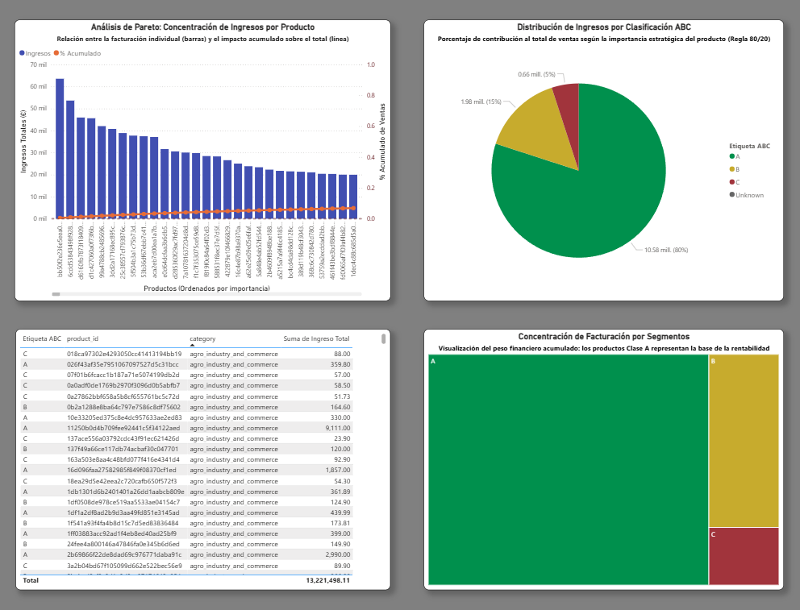
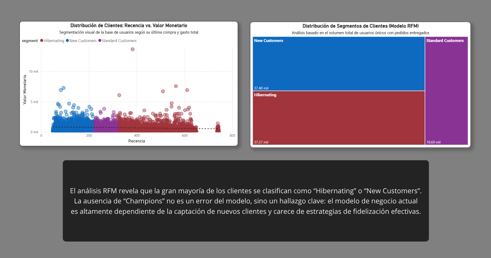
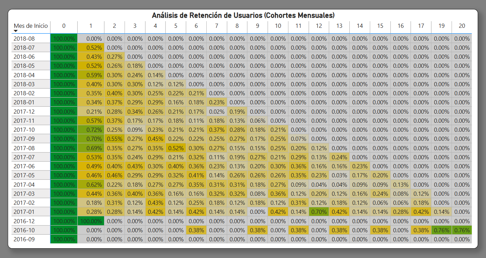
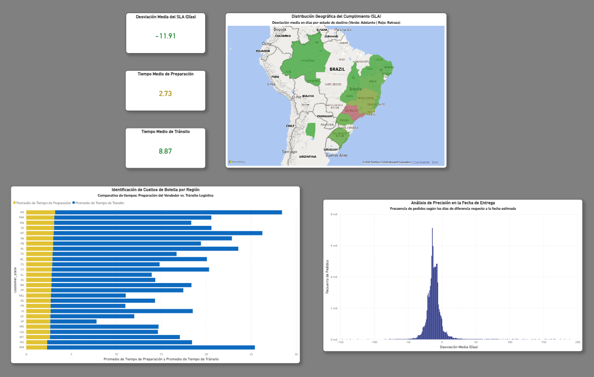

# Olist E-commerce Analytics API

Plataforma de procesamiento y análisis de datos diseñada para transformar registros transaccionales de Olist en insights estratégicos. El sistema combina una arquitectura robusta de backend con potentes visualizaciones de Business Intelligence.

---

## Visual Insights (Dashboard Preview)

El valor final del proyecto se materializa en dashboards interactivos que permiten la toma de decisiones basada en datos.

### **1. Análisis de Rentabilidad (Clasificación ABC)**

Identificación de los productos estrella mediante la Ley de Pareto, permitiendo optimizar el inventario y los esfuerzos de marketing.

### **2. Segmentación de Clientes (Modelo RFM)**

Clasificación de usuarios según su Recencia, Frecuencia y Valor Monetario para identificar clientes fidelizados y aquellos en riesgo de abandono.

### **3. Retención y Cohortes**

Análisis del ciclo de vida del cliente para entender la recurrencia de compra a lo largo del tiempo.

### **4. Análisis Logístico (SLA)**

Monitorización del rendimiento de los servicios de transporte y cumplimiento de los tiempos pactados. Permite identificar cuellos de botella operativos mediante el contraste entre la fecha estimada y la fecha real de recepción.

---

## Arquitectura

El proyecto sigue una **arquitectura modular de tres capas**, garantizando que la lógica de datos esté separada de la entrega de la API:

1.  **Routes (API Layer):** Gestión de endpoints REST con **Flask**.
2.  **Services (Business Logic):** Procesamiento de datos y cálculos complejos con **Pandas** y **NumPy**.
3.  **Repositories (Data Access):** Consultas optimizadas en **SQL puro** (PostgreSQL) para garantizar eficiencia en la extracción.

> **Nota técnica:** Por optimización de almacenamiento en DB Cloud (límite 1GB), se omitió la tabla de geolocalización, delegando el análisis geográfico a las dimensiones presentes en las tablas de clientes y vendedores.

---

## Instalación y Configuración

1. **Clonar el repositorio:** `git clone ...`
2. **Crear entorno virtual:** `python -m venv venv`
3. **Instalar dependencias:** `pip install -r requirements.txt`
4. **Configurar variables de entorno:** Crea un archivo `.env` con las credenciales de PostgreSQL

---

## Base de Datos

Para inicializarla:

1. **Crear tablas:** `python -m scripts.init_db`
2. **Cargar datos:** `python -m scripts.ingest_data`

---

## Estructura clave del Proyecto

- `app/api/routes`: Endpoints de la API.
- `app/services`: Lógica de negocio y procesamiento con Pandas.
- `app/repositories`: Consultas SQL puras.

---

## Tecnologías

- **Backend:** Flask / Python
- **Base de Datos:** PostgreSQL
- **Análisis:** Pandas / Numpy
- **Visualización:** Power BI Desktop
